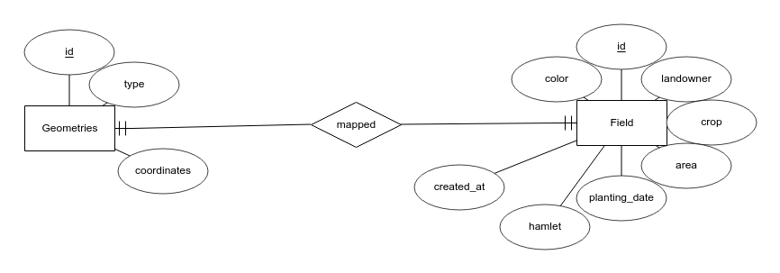

# Sistem Informasi Geografis Persawahan
A rich geographical information system for mapping the agricultural lands by using satellite imagery. Built with LeafletJS library and Codeigniter framework.


## Entity Relationship Diagram


## Installation
1. Save the project folder name as `sig-sawah`
2. Create a new database called `sig_sawah`

## Database
Default db file is postgresql located in `db.psql`

If you prefer MySQL or MariaDB then use `db.sql` for the migration. Then, change the code inside `/application/config/database.php` into :

```php
$db['default'] = array(
	'dsn'	=> '',
	'hostname' => 'localhost',
	'username' => 'root',
	'password' => '',
	'database' => 'sig_sawah',
	'dbdriver' => 'mysqli',
	...
);
```

